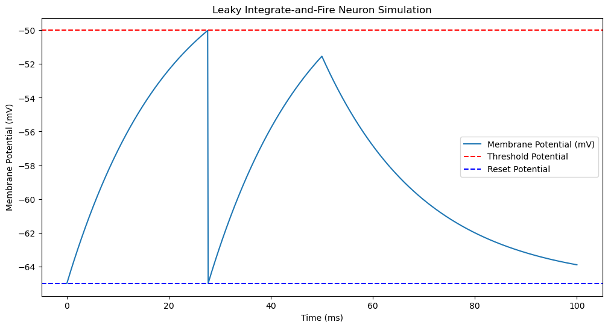

# SpikingNeuralNetworksDemo

1. **Neuron**: The basic unit of the nervous system, responsible for processing and transmitting information.

2. **Synapse**: The junction between two neurons where information is transmitted from one neuron to another.

3. **Axon**: Transmits signals away from the cell body, usually one per neuron, can be long, often myelinated, smooth structure.

4. **Dendrite**: Receives signals toward the cell body, many per neuron, short and branched, not myelinated, tree-like structure.

5. **Neuromorphic**: Referring to the design and development of hardware and software systems inspired by the structure and function of the human brain.

6. **Synaptic Plasticity**: The ability of synapses to strengthen or weaken over time, in response to increases or decreases in their activity.

7. **Neurotransmitter**: Chemicals that transmit signals across a synapse from one neuron to another.

## The Coming Revolution

### Exciting Times for Spiking Neural Networks (SNNs)
- New ways to train SNNs.
- Development of neuromorphic hardware.
- Low power consumption.

### Advantages of Computation with SNNs
- **Fast Computation / Rapid Decision-Making**: The ability of SNNs to process information and make decisions quickly, often in real-time.
- **Multiplexing**: Simultaneous processing and transmission of multiple signals or types of information over a single channel or pathway.

### Neuromorphic Hardware
- Mimics the brain's architecture for massive parallelism.
- Designed for efficient use of power and resources.
- Enables real-time adaptation and rapid decision-making.

### Synaptic Plasticity
- The ability of synapses to strengthen or weaken over time in response to increases or decreases in activity.

### Neurotransmitters
- Chemicals that transmit signals across a synapse from one neuron to another.

### Artificial Neural Networks (ANNs)
- Computational models inspired by neural circuits in the brain.
- Used for tasks such as pattern recognition and machine learning.

### Key Points
- **Neuron**: Basic unit of the nervous system, processes and transmits information.
- **Synapse**: Junction between two neurons for signal transmission.
- **Axon**: Long, thread-like part of a neuron transmitting impulses away from the cell body.
- **Dendrite**: Branched projections of a neuron receiving signals from other neurons.

## Summary
Spiking Neural Networks (SNNs) and neuromorphic hardware offer significant advantages in terms of speed, efficiency, and real-time processing, drawing inspiration from the structure and function of the human brain.

## Leaky Integrate-and-Fire (LIF) Neuron Model

### Fundamental Concept
**Membrane Potential:** electrical potential difference across the membrane of a neuron or other excitable cell. This potential difference arises due to the distribution of ions across the cell membrane and their movement through ion channels. 

The membrane potential V is defined as: 
V = Vinside − Voutside 
Vinside ​is the electrical potential inside the cell(neuron). 
Voutside is the electrical potential outside the cell(neuron). 

**Membrane Time Constant τm:** τ represents a time constant, The subscript m stands for "membrane".

τm = RC
- R is the membrane resistance. With higher resistance, the membrane potential changes more slowly because the current flow is reduced.
- C is the membrane capacitance. With higher capacitance, the membrane can store more charge, leading to a slower change in membrane potential for a given input current.

Example:
Membrane resistance 𝑅 = 10MΩ
Membrane capacitance 𝐶 = 100pF
Membrane time constant τm = RC = 10×100 = 1000ms

### Model Description
The **Leaky Integrate-and-Fire (LIF)** neuron is a simple model that describes how a neuron's membrane potential evolves over time and generates spikes. The membrane potential V of the neuron is governed by the following differential equation:

τm(dt/dV(t)) = −(V(t)−Vrest)+RmI(t)

where:
- τm is the membrane time constant (the time it takes for the membrane potential to decay to 1/e of its value).
- V(t) is the membrane potential at time t.
- Vrest is the resting potential (the potential at which the neuron is at rest).
- Rm is the membrane resistance.
- I(t) is the input current at time t.

-  τm is the membrane time constant

### Dynamics of the LIF Model
1. **Integration**:
   - The input current I(t) causes the membrane potential V(t) to increase.
   - The term -(V(t)−Vrest) represents the "leak" that causes the membrane potential to decay back towards the resting potential Vrest.

2. **Firing**:
   - When the membrane potential V(t) reaches a certain threshold Vth, the neuron "fires" or generates a spike.
   - After firing, the membrane potential is reset to a lower value Vreset.

3. **Refractory Period**:
   - After a spike, there may be a refractory period during which the neuron is unable to fire again, allowing the neuron to reset.

### Summary
The LIF model is a simple yet powerful way to describe the dynamics of a neuron's membrane potential and its spiking behavior. The key components of the model are:
- The integration of input currents that increase the membrane potential.
- The leakage that causes the membrane potential to decay.
- The threshold mechanism that triggers spikes when the membrane potential reaches a certain value.

This model is widely used in computational neuroscience to study neural behavior and network dynamics.