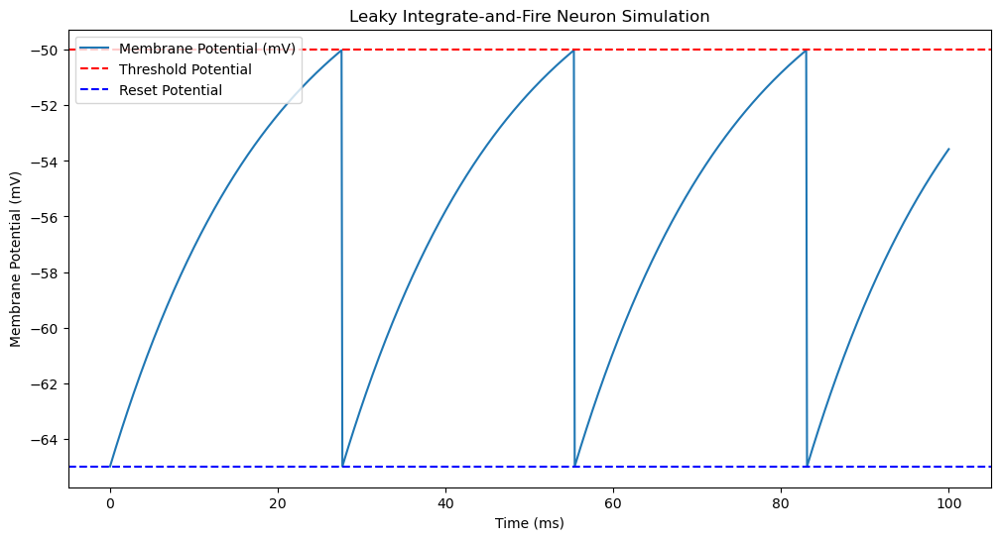

# SpikingNeuralNetworksDemo

## Table of Contents
1. [Introduction](#introduction)
   - [Key Terms](#key-terms)
   - [The Coming Revolution](#the-coming-revolution)

2. [Leaky Integrate-and-Fire (LIF) Neuron Model](#leaky-integrate-and-fire-lif-neuron-model)
   - [Fundamental Concept](#fundamental-concept)
   - [Model Description](#model-description)
   - [Dynamics of the LIF Model](#dynamics-of-the-lif-model)
   - [Python Simulation Code](#python-simulation-code)

## Introduction

### Key Terms

1. **Neuron**: The basic unit of the nervous system, responsible for processing and transmitting information.
2. **Synapse**: The junction between two neurons where information is transmitted from one neuron to another.
3. **Axon**: Transmits signals away from the cell body, usually one per neuron, can be long, often myelinated, smooth structure.
4. **Dendrite**: Receives signals toward the cell body, many per neuron, short and branched, not myelinated, tree-like structure.
5. **Neuromorphic**: Referring to the design and development of hardware and software systems inspired by the structure and function of the human brain.
6. **Synaptic Plasticity**: The ability of synapses to strengthen or weaken over time, in response to increases or decreases in their activity.

### The Coming Revolution

#### Exciting Times for Spiking Neural Networks (SNNs)
- New ways to train SNNs.
- Development of neuromorphic hardware.
- Low power consumption.

#### Advantages of Computation with SNNs
- **Fast Computation / Rapid Decision-Making**: The ability of SNNs to process information and make decisions quickly, often in real-time.
- **Multiplexing**: Simultaneous processing and transmission of multiple signals or types of information over a single channel or pathway.

#### Neuromorphic Hardware
- Mimics the brain's architecture for massive parallelism.
- Designed for efficient use of power and resources.
- Enables real-time adaptation and rapid decision-making.

### Summary
Spiking Neural Networks (SNNs) and neuromorphic hardware offer significant advantages in terms of speed, efficiency, and real-time processing, drawing inspiration from the structure and function of the human brain.

## Leaky Integrate-and-Fire (LIF) Neuron Model

### Fundamental Concept

**Membrane Time Constant $\tau_m$:** τ represents a time constant, The subscript m stands for "membrane".
$\tau_m$ = RC
- R is the membrane resistance. With higher resistance, the membrane potential changes more slowly because the current flow is reduced.
- C is the membrane capacitance. With higher capacitance, the membrane can store more charge, leading to a slower change in membrane potential for a given input current.

Example:
Membrane resistance 𝑅 = 10MΩ
Membrane capacitance 𝐶 = 100pF
Membrane time constant τm = RC = 10×100 = 1000ms

**Membrane Potential:** electrical potential difference across the membrane of a neuron or other excitable cell. This potential difference arises due to the distribution of ions across the cell membrane and their movement through ion channels.<br>

The membrane potential V$V$is defined as:<br>
$V = V_{\text{inside}} − V_{\text{outside}}$<br>
$V_{\text{inside}}$ ​is the electrical potential inside the cell(neuron).<br>
$V_{\text{outside}}$ is the electrical potential outside the cell(neuron).<br>

### Model Description
The **Leaky Integrate-and-Fire (LIF)** neuron is a simple model that describes how a neuron's membrane potential evolves over time and generates spikes. Main function of using the Leaky Integrate-and-Fire (LIF) model is to obtain the membrane potential V[t] at any given moment t and to analyze V over a period of time. The membrane potential V of the neuron is governed by the following differential equation:

$$\tau_m \frac{dV(t)}{dt} = - (V(t) - V_{\text{rest}}) + R I(t)$$

where:
- $\tau_m$ is the membrane time constant, which represents the rate at which the membrane potential decays over time.
- $V(t)$ is the membrane potential at time t.
- $V_{\text{rest}}$ is the resting potential (the potential at which the neuron is at rest).
- $R$ is the membrane resistance.
- $I(t)$ is the input current at time t.

### Key Features
1. **Leakage Term**: The term $$- (V(t) - V_{\text{rest}})$$ represents the leakage of the membrane potential towards the resting potential Vrest. This term ensures that the membrane potential decays back to the resting potential in the absence of input current.


2. **Input Current**: The term RI(t) represents the input current scaled by the membrane resistance. This term drives the membrane potential towards depolarization(less negative) when there is input current.


### Equations in Discrete Time

In a discrete-time simulation, the LIF model can be approximated as:

$$V[t + \Delta t] = V[t] + \frac{\Delta t}{\tau_m} \left( - (V[t] - V_{\text{rest}}) + R I[t] \right)$$

where $\Delta t$ is the time step of the simulation.

Example:<br>
tau = 20.0         # Membrane time constant (ms)<br>
R = 1.0            # Membrane resistance (Ohms)<br>
V_rest = -65.0     # Resting membrane potential (mV)<br>
V_th = -50.0       # Threshold potential (mV)<br>
V_reset = -65.0    # Reset potential after firing (mV)<br>
I = 20.0           # Increased input current (uA/cm^2)<br>
dt = 0.1           # Time step (ms)<br>

$$V[t + \Delta t] = V[t] + \frac{\Delta t}{\tau_m} \left( - (V[t] - V_{\text{rest}}) + R I[t] \right)$$

$$V[0 + 0.1] = -65 + \frac{0.1}{20.0} \left( - ((-65) - (-65)) + 1 \times 20.0 \right)$$

$$V[0.1] = 64.9$$

### Dynamics of the LIF Model
1. **Integration**:
   - The input current I(t) causes the membrane potential V(t) to increase.
   - The term -(V(t)−Vrest) represents the "leak" that causes the membrane potential to decay back towards the resting potential Vrest.

2. **Firing**:
   - When the membrane potential V(t) reaches a certain threshold Vth, the neuron "fires" or generates a spike.
   - After firing, the membrane potential is reset to a lower value Vreset.

3. **Refractory Period**:
   - After a spike, there may be a refractory period during which the neuron is unable to fire again, allowing the neuron to reset.

### Python Simulation Code
```python
import numpy as np
import matplotlib.pyplot as plt

# Parameters
tau = 20.0         # Membrane time constant (ms)
R = 1.0            # Membrane resistance (Ohms)
V_rest = -65.0     # Resting membrane potential (mV)
V_th = -50.0       # Threshold potential (mV)
V_reset = -65.0    # Reset potential after firing (mV)
I = 20.0           # Increased input current (uA/cm^2)
dt = 0.1           # Time step (ms)
T = 100.0          # Total simulation time (ms)

# Time array
time = np.arange(0, T + dt, dt)

# Initialize membrane potential
V = np.zeros_like(time)
V[0] = V_rest

# Simulation loop
for t in range(1, len(time)):
    # Update the membrane potential using the differential equation
    dV = (- (V[t-1] - V_rest) + R * I) / tau
    V[t] = V[t-1] + dV * dt
    # print(V[t])
    
    # Check for firing
    if V[t] >= V_th:
        V[t] = V_reset  # Reset potential after firing

# Create the plot
plt.figure(figsize=(12, 6))

# Plot the membrane potential V(t) vs. time t
plt.plot(time, V, label='Membrane Potential (mV)')
plt.axhline(V_th, color='r', linestyle='--', label='Threshold Potential')
plt.axhline(V_reset, color='b', linestyle='--', label='Reset Potential')
plt.xlabel('Time (ms)')
plt.ylabel('Membrane Potential (mV)')
plt.title('Leaky Integrate-and-Fire Neuron Simulation')
plt.legend()
plt.show()
```